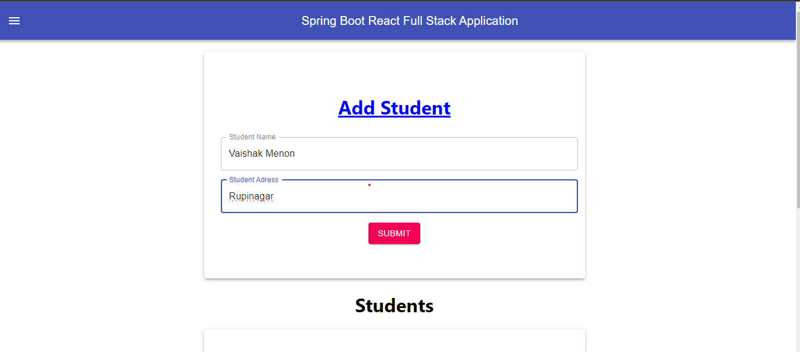
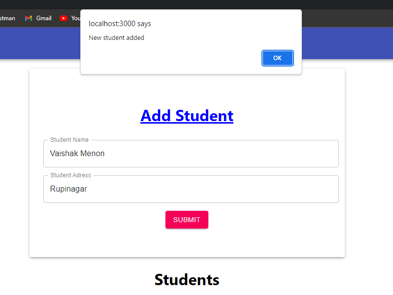
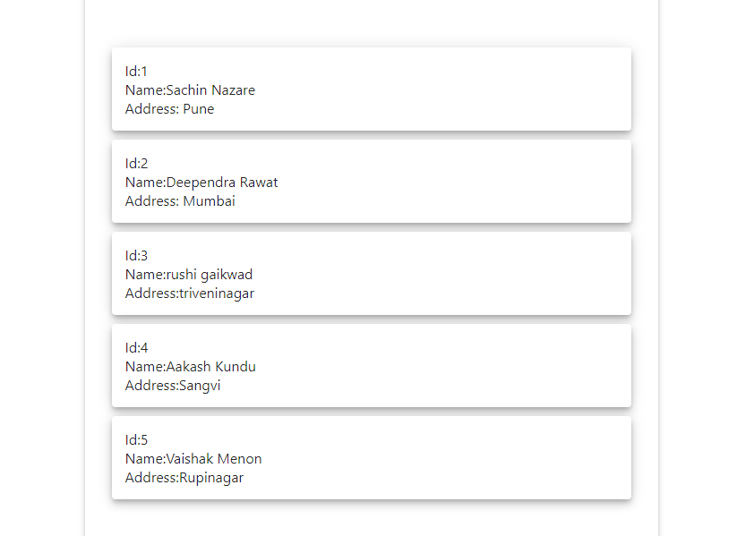

# Student Information Management System

This is a simple web application built with React.js and Material-UI/icons for managing student information and storing it in a MySQL database.

## Features

- Add student names and addresses to the database.
- View a list of students present in the database.

## Prerequisites

Before you begin, ensure you have the following tools installed:

- [Node.js](https://nodejs.org/)
- [npm](https://www.npmjs.com/)
- [IntelliJ IDEA](https://www.jetbrains.com/idea/)
- [MySQL](https://www.mysql.com/)

## Getting Started

1. Clone this repository to your local machine:

   ```bash
   git clone https://github.com/sachinnazare/frontendfullstack.git
Navigate to the project directory:

bash
Copy code
cd student-info-app
Install the project dependencies:

bash
Copy code
npm install
Configure the backend:

Set up a MySQL database to store student information.
Configure the database connection in the backend code (using Node.js) located in the backend directory.
Start the backend server (assuming you have configured it):

bash
Copy code
npm start
Open your web browser and go to http://localhost:3000 to access the application.
 
## Usage
To add a new student, click on the "Submit" button and enter the student's name and address.
Click the "Subbmit" button to save the student's information to the database.
To view the list of students, reload and scroll down
Screenshots




## License
This project is licensed under the MIT License - see the LICENSE file for details.

